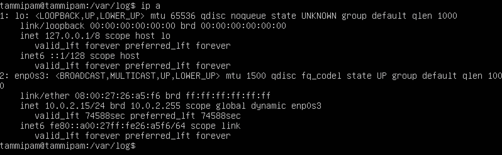
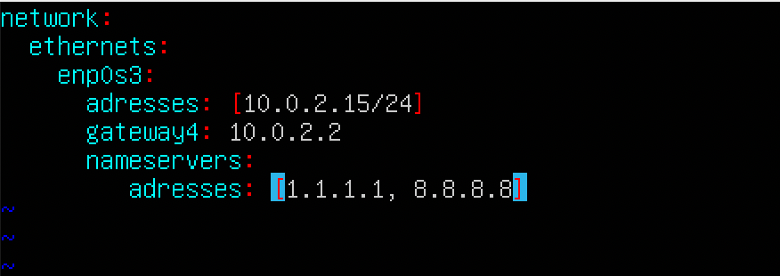
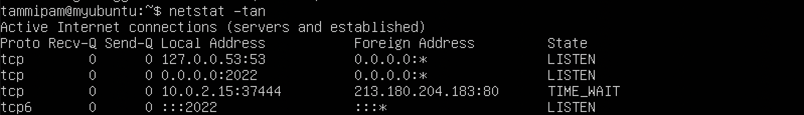
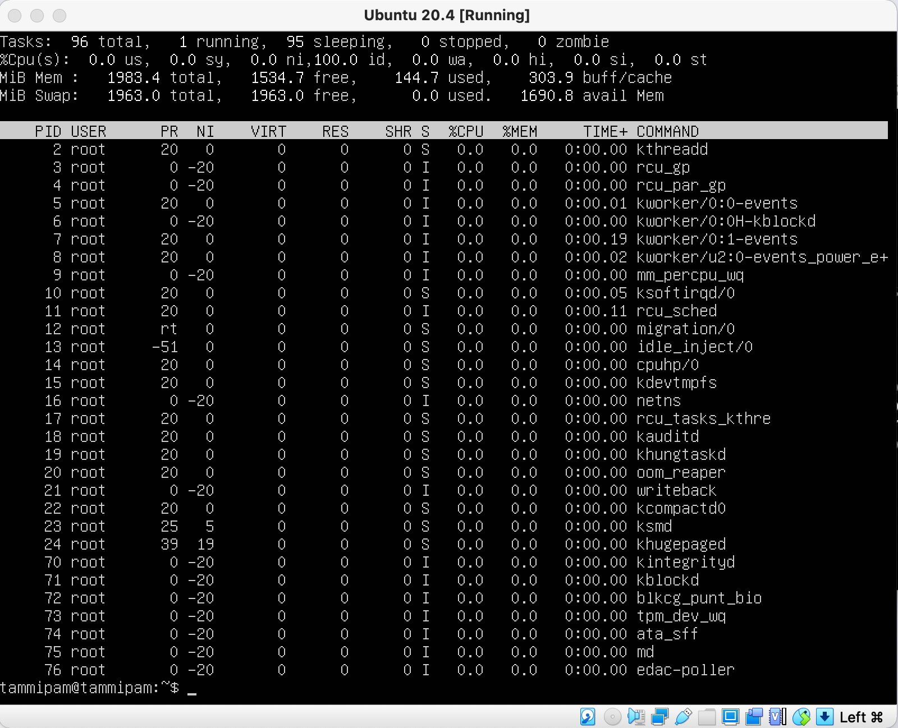

# Операционные системы UNIX/Linux (Базовый).

## Contents

[Chapter III](#chapter-iii) \
    3.1 [Установка ОС](#part-1-установка-ос)  
    3.2 [Создание пользователя](#part-2-создание-пользователя)  
    3.3 [Настройка сети ОС](#part-3-настройка-сети-ос)   
    3.4 [Обновление ОС](#part-4-обновление-ос)  
    3.5 [Использование команды  sudo](#part-5-использование-команды-sudo)  
    3.6 [Установка и настройка службы времени](#part-6-установка-и-настройка-службы-времени)  
    3.7 [Установка и использование текстовых редакторов](#part-7-установка-и-использование-текстовых-редакторов)  
    3.8 [Установка и базовая настройка сервиса SSHD](#part-8-установка-и-базовая-настройка-сервиса-sshd)   
    3.9 [Установка и использование утилит top, htop](#part-9-установка-и-использование-утилит-top-htop)   
    3.10 [Использование утилиты fdisk](#part-10-использование-утилиты-fdisk)   
    3.11 [Использование утилиты df](#part-11-использование-утилиты-df)    
    3.12 [Использование утилиты du](#part-12-использование-утилиты-du)    
    3.13 [Установка и использование утилиты ncdu](#part-13-установка-и-использование-утилиты-ncdu)    
    3.14 [Работа с системными журналами](#part-14-работа-с-системными-журналами)     
    3.15 [Использование планировщика заданий CRON](#part-15-использование-планировщика-заданий-cron)    

## Chapter III

## Part 1. Установка ОС

- Версия Ubuntu cat /etc/issue 

## Part 2. Создание пользователя

- Добавление пользователя 

`sudo adduser user1` \
`sudo groupadd eternal_group` \
`sudo usermod eternal_group user1` \
`sudo chgrp -R eternal_group /var/log/` \
`sudo chmod g+r /var/log/` 

## Part 3. Настройка сети ОС

- Создание сети

`hostnamectl set-hostname user-1`

- Смена временной зоны

`timedatectl set-timezone Europe/Moscow`

- Интерфейс io

`ip a`

- Переходим в var/log/ 

`ip a`

- Переходим в /var/lib/dhcp/

`sudo dhclient -v`

- Смотрим информацию из dhclient.leases

`less /var/lib/dhcp/dhclient.leases`

- IP адрес 

Внешний IP-адрес или публичный IP-адрес - это IP-адрес интерфейса маршрутизатора, подключенного к Интернету. 
(ip1.png)
Внутренний IP-адрес - это диапазон IP-адресов, не связанных с Интернетом, используемых во внутренней сети. Внутренние IP-адреса предоставляются сетевыми устройствами, такими как маршрутизаторы, с использованием преобразования сетевых адресов.
(ip2.png)

- Изменение ip адреса

- До перезагрузки 

- После перезагрузки

- Проверка ping

`ping 1.1.1.1` \ 
`ping ya.ru`

## Part 4. Обновление ОС

- Проверка обновлений

`sudo apt-get upgrade`

- После обновления 

## Part 5. Использование команды **sudo**

В операционной системе Ubuntu пользователи, которые состоят в группе «sudo», могут выполнять задачи администратора, используя одноименную группе команду — sudo. Сегодня мы рассмотрим, как дать пользователю данную привелегию или же ее отозвать.

- Добавление user1 d root

`sudo usermod -aG sudo user1` \
`su user1` \
`sudo whoami`

- Изменение названия хоста от имени user1

`sudo hostnamectl set-hostname my_ubuntu`

## Part 6. Установка и настройка службы времени

- Изменение даты/времени

`timedatectl` \
`sudo timedatectl set-ntp on` \
`timedatectl status`

## Part 7. Установка и использование текстовых редакторов 

- Установка программ

`sudo apt install vim` \
`sudo apt install nano` \
`sudo apt install mcedit`

- Создание файла vim(i for create, esc + shift + : wq for save&out)

`vim test_vim.txt`

- Создание файла nano(press control+x+y+enter for save&exit)

`nano test_nano.txt`

- Создание файла mcedit(esc + yes + enter)

`mcedit test_mcedit.txt`

- Изменение файлов 

`i+esc+shift :+q!+enter`

`control+x+n+enter`

`esc + no + enter`

- Поиск и замена

`/%s/abobus/peertopeer/g`

`ctr+w ctr+\`

`fn+f7 fn+f4`

## Part 8. Установка и базовая настройка сервиса **SSHD**

`sudo apt-get install openssh-server` \
`sudo systemctl enable ssh` \
`sudo systemctl status ssh`

`sudo ufw allow ssh` \
`sudo ufw enable` \
`sudo ufw status`

`sudo vim /etc/ssh/sshd_config`

`service ssh restart`
`sudo apt-get install netstat`
`sudo apt install net-tools`
`netstat -tan`

- *Netstat* отображает активные TCP-подключения, порты, на которых компьютер прослушивается, статистика Ethernet, таблица маршрутизации IP-адресов, статистика IPv4 (для протоколов IP, ICMP, TCP и UDP) и Статистика IPv6 (для протоколов IPv6, ICMPv6, TCP по IPv6 и UDP через IPv6). При использовании без параметров эта команда отображает активные TCP-подключения. 
- -a	Отображает все активные TCP-подключения и порты TCP и UDP, прослушиваемые компьютером.
- -n	Отображает активные TCP-подключения, однако адреса и номера портов выражаются в числовом виде, и для определения имен не выполняется никаких попыток.
- -t (--tcp) tcp протокол

`ps aux | grep sshd`

Опция a указывает ps вывести на дисплей процессы всех пользователей, за исключением тех процессов, которые не связаны с терминалом и процессами группы лидеров.
В u — подставки для ориентированных на пользователя формате, который обеспечивает подробную информацию о процессах.
Опция x в ps перечисляет процессы без управляющего терминала. В основном это процессы, которые запускаются во время загрузки и работают в фоновом режиме.

## Part 9. Установка и использование утилит **top**, **htop**

- top (table of processes) — консольная команда, которая выводит список работающих в системе процессов и информацию о них

- top utility uptime - текущее время и продолжительность времени с момента последней загрузки

- количество авторизованных пользователей

- total system load - средняя загрузка системы за последние 1, 5 и 15 минут

- total number of processes - показывает общее количество задач или потоков, в зависимости от состояния переключателя режима потоков. Эта сумма далее классифицируется как: running; sleeping; stopped; zombie

- cpu load - показывает проценты состояния ЦП на основе интервала с момента последнего обновления. По умолчанию отображаются проценты для этих отдельных категорий. Там, где ниже показаны две метки, первыми отображаются метки для более поздних версий ядра. us, user : время работы ненастроенных пользовательских процессов sy, system : время работы процессов ядра ni, nice : время работы id процессов пользователя niced, idle : время, проведенное в обработчике простоя ядра wa, IO-wait : время ожидания I/ O завершение hi : время, затраченное на обслуживание аппаратных прерываний si : время, затраченное на обслуживание программных прерываний st : время, украденное из этой виртуальной машины гипервизором

загрузка памяти Эта часть состоит из двух строк, которые могут выражать значения в кибибайтах (КиБ). По умолчанию Строка 1 отражает физическую память, классифицируемую как: общая, свободная, используемая и усиленная/кэш. Строка 2 отражает в основном виртуальную память, классифицируемую как: общая. , free, used и avail (физическая память). Число avail в строке 2 является оценкой физической памяти, доступной для запуска новых приложений без свопинга.

- pid of the process

- processes sorted by memory

- processes sorted by cpu time

- htop utility to sort, press `F6` and select the desired parameter

- sorted by PID

- sorted by PERCENT_CPU

- sorted by PERCENT_MEM

- sorted by TIME(`F4` to filter)

- filtered for sshd process(`F3` to search)

- searching press `F2`, add Hostname and Clock to Right column

## Part 10. Использование утилиты **fdisk**

- `sudo fdisk -l`

## Part 11. Использование утилиты **df** 

- `sudo df`

- `sudo df /`

- `df -Th` (`-T` - print file system type `-h` - print sizes in powers of 1024 (human-readable))

## Part 12. Использование утилиты **du**

- `sudo du -shb /home /var/log /var` 

- `sudo du -sh /home /var/log /var`(human readable sizes)

- `sudo du /home /var/log/*` 

## Part 13. Установка и использование утилиты **ncdu**

- `sudo apt-get install -y ncdu` 

## Part 14. Работа с системными журналами

- /var/log/dmesg

/var/log/syslog

/var/log/auth.log

- last log

- `sudo systemctl restart ssh.service`

## Part 15. Использование планировщика заданий **CRON**

- `crontab -e`

